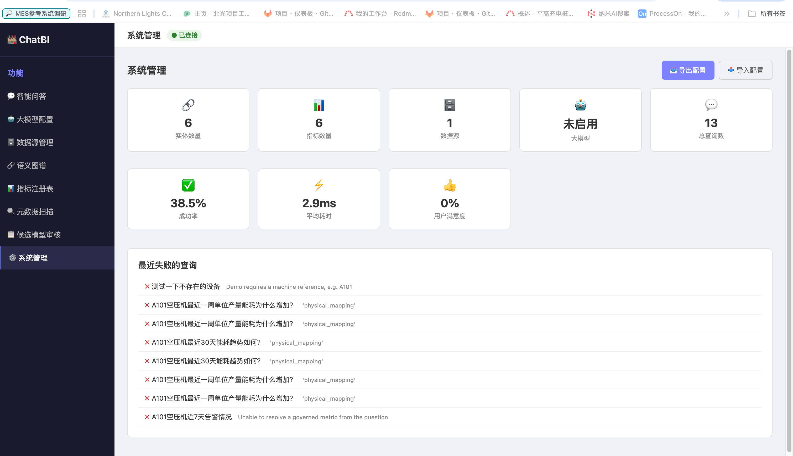
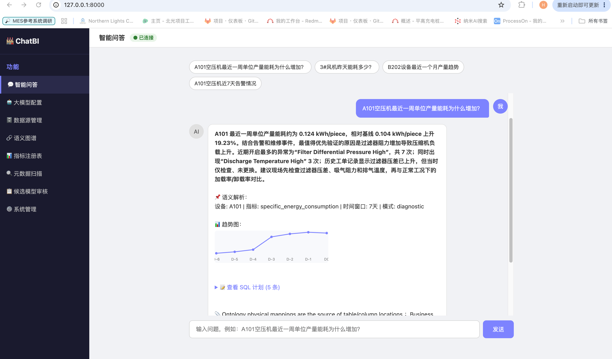
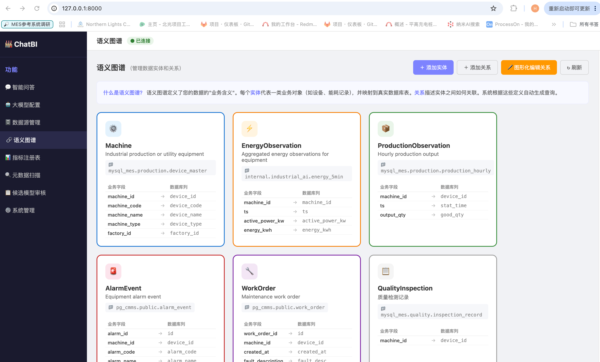
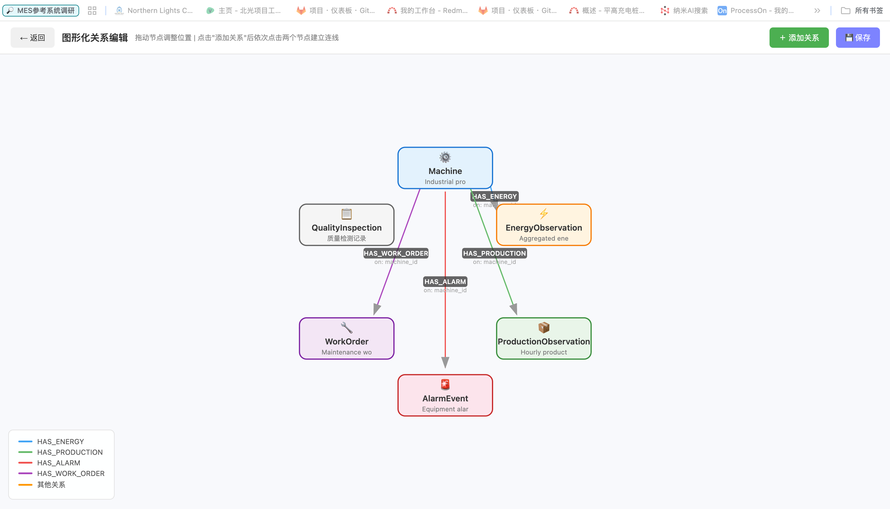
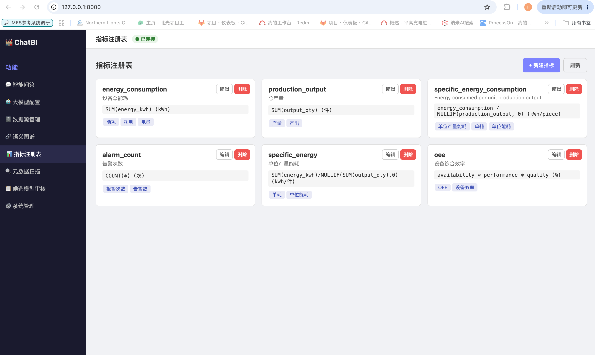

# Industrial Semantic ChatBI

面向企业的**语义化商业智能对话系统**。通过简单配置数据源、描述实体和关系，快速将企业多系统数据转化为自然语言问答 AI，无需编写代码。

## 应用场景

- **工业设备能耗分析** — 查询设备能耗趋势、单位产量能耗、峰值负荷等指标
- **生产异常诊断** — 关联告警事件、维修工单，自动定位能耗异常根因
- **跨系统数据联邦** — 统一查询分散在 MES（MySQL）、CMMS（PostgreSQL）、数据仓库（Doris）中的数据
- **语义模型管理** — 通过 UI 管理本体、指标、数据源映射，图形化编辑实体关系
- **能源管理** — 电表读数、费用统计、碳排放追踪
- **仓储物流** — 库存查询、出入库分析

## 系统架构

```
用户自然语言提问
       |
+------------------------------------------+
|  语义解析层                               |
|  Rules Engine / LLM Parser              |---> SemanticIntent
|  (LLM 只解析意图，不生成 SQL)             |
|  + 置信度评估 + 不确定性表达              |
+------------------------------------------+
       |
+------------------------------------------+
|  语义模型层                               |
|  Industrial Ontology + Aliases          |---> 逻辑实体 -> 物理表列映射
|  Metric Registry + Enums                |---> 指标/同义词/枚举值
|  JOIN Path Finder                       |---> 多跳关系自动推导
+------------------------------------------+
       |
+------------------------------------------+
|  查询治理层                               |
|  QueryPlanner + Cache                   |---> 基于本体生成 SQL + 缓存
|  SQL Guardrail                          |---> 只读 + 时间过滤 + 安全校验
+------------------------------------------+
       |
+------------------------------------------+
|  执行层                                  |
|  Doris / MySQL / PostgreSQL             |---> 多数据源联邦查询
|  Health Monitor                         |---> 数据源连通性监控
+------------------------------------------+
       |
+------------------------------------------+
|  回答生成                                 |
|  Template / LLM Composer                |---> 结合数据生成分析回答
|  + 图表可视化 + 证据链溯源               |
+------------------------------------------+
       |
+------------------------------------------+
|  可观测性                                 |
|  Query Stats / Audit Log / Feedback     |---> 性能统计/审计/满意度
+------------------------------------------+
```

## 功能模块

### 💬 智能问答
- 自然语言输入，自动解析设备编码、指标同义词、时间窗口
- **多轮对话** — 支持 session 上下文，连续追问
- **图表可视化** — 趋势数据自动渲染 SVG 折线图
- **SQL 预览确认** — 可先查看 SQL 计划再决定是否执行
- **问题联想推荐** — 输入时自动提示相关问题
- **置信度评估** — 每次回答附带解析置信度，低信心时明确告知
- **证据链溯源** — 展示回答依据的数据源、SQL、JOIN 路径
- **查询缓存** — 相同问题 5 分钟内直接返回缓存，减少数据库负载
- **用户反馈** — 👍👎 按钮记录满意度，持续优化

### 🤖 大模型配置
- 支持 OpenAI / Azure OpenAI / Ollama / vLLM / DeepSeek 等 OpenAI 兼容 API
- 启用后驱动语义解析和对话回答
- 未启用时自动降级为规则引擎 + 模板回答
- UI 上一键测试连接

### 🗄️ 数据源管理
- 支持 Apache Doris、MySQL、PostgreSQL、EXCEL、API
- UI 配置连接参数、测试连通性
- 对数据源执行元数据扫描
- **数据预览** — 预览任意表的前 N 行数据
- **健康监控** — 自动检测所有数据源连通状态

### 🔗 语义图谱
- 可视化实体卡片（颜色编码 + 字段映射表格）
- UI 新建/编辑实体，动态增删字段行
- **图形化关系编辑** — 独立画布，拖拽节点、点击连线、右键菜单修改/删除
- **JOIN 路径自动推导** — BFS 发现实体间最短关联路径

### 📊 指标注册表
- 管理指标定义（表达式、单位、同义词）
- UI 创建/编辑/删除
- 候选模型审核通过时自动合并

### 🔍 元数据扫描
- **自动扫描** — 连接数据源，自动发现表结构并生成候选语义模型
- **手动添加** — 表单手动创建候选模型

### 📋 候选模型审核
- Tab 分类：待审核 / 已通过 / 已驳回
- 批准后自动合并到运行时本体和指标注册表
- 显示审核备注

### ⚙️ 系统管理
- **仪表盘** — 实体数、指标数、数据源数、查询成功率、平均耗时、满意度
- **失败问题列表** — 最近解析失败的问题，帮助优化语义模型
- **配置导出** — 一键导出全部配置为 JSON（密码自动脱敏）
- **配置导入** — 上传 JSON 恢复配置
- **审计日志** — 记录所有操作（谁、何时、做了什么）
- **缓存管理** — 查看/清空查询缓存

### 🏭 行业模板
- 制造业通用、能源管理、仓储物流三套预置模板
- 一键应用：自动创建实体、关系、指标、别名
- 不覆盖已有完整映射的实体

### 🏷️ 字段别名与枚举映射
- 统一不同系统的字段叫法（设备编号/资产编号 → machine_code）
- 枚举值业务含义（machine_type="A" → "空压机"）

## 技术方案

| 层面 | 技术选型 |
|------|---------|
| 后端框架 | FastAPI + Uvicorn |
| 数据模型 | Pydantic v2 |
| 配置格式 | YAML（本体/指标） + JSON（运行时数据） |
| 数据库驱动 | PyMySQL（Doris/MySQL），psycopg2（PostgreSQL 可选） |
| 语义解析 | 规则引擎（正则 + 同义词） / OpenAI-compatible LLM |
| 路径发现 | BFS 图遍历（JoinPathFinder） |
| SQL 安全 | Guardrail（只读 + 时间过滤 + 禁止危险操作） |
| 缓存 | 文件 JSON + MD5 key + TTL 淘汰 |
| 前端 | 单页 HTML + 原生 JS + SVG 图表（无框架依赖） |
| 部署 | Python 3.10+，pip install 即可运行 |

## 安装与运行

### 环境要求

- Python 3.10+
- pip

### 安装

```bash
git clone https://github.com/KevinXu816/Industrial-Semantic-ChatBI.git
cd Industrial-Semantic-ChatBI
python -m venv .venv
source .venv/bin/activate
pip install -r requirements.txt
```

### 启动

```bash
uvicorn app.main:app --reload --port 8000
```

访问 http://127.0.0.1:8000/ 打开 Web UI，API 文档在 http://127.0.0.1:8000/docs

默认使用 Mock 模式，无需连接真实数据库即可体验完整流程。

### 快速开始

1. 打开 Web UI
2. (可选) 配置大模型：大模型配置 → 填写 API 地址 → 启用
3. (可选) 应用行业模板：系统管理 → 行业模板
4. 配置数据源：数据源管理 → 新建 → 填写连接参数 → 测试 → 扫描
5. 审核候选模型：候选模型审核 → 批准
6. 开始提问：智能问答 → 输入自然语言问题

### 配置大模型

示例（Ollama 本地）：
```
API 地址: http://localhost:11434/v1
模型名称: qwen2.5
```

示例（OpenAI）：
```
API 地址: https://api.openai.com/v1
模型名称: gpt-4o
API Key: sk-...
```

### 连接数据源（环境变量方式）

```bash
export METADATA_MODE=doris
export DORIS_HOST=127.0.0.1
export DORIS_PORT=9030
export DORIS_USER=root
export DORIS_PASSWORD='password'
```

## 项目结构

```
app/
  main.py                 # FastAPI 应用入口 + 全部路由
  semantic.py             # 语义注册中心（本体 + 指标 + 解析器）
  planner.py              # 基于本体的 SQL 查询规划器
  guardrail.py            # SQL 安全护栏
  executor.py             # 查询执行器（Mock / Doris）
  answer.py               # 回答生成器（模板 / LLM）
  llm_service.py          # LLM 服务（OpenAI 兼容接口）
  llm_planner.py          # LLM 语义解析器
  metadata.py             # 元数据扫描器（Mock / Doris）
  datasource.py           # 多数据源配置与扫描
  candidate_generator.py  # 候选语义模型生成
  review_store.py         # 候选模型审核存储
  chat_session.py         # 多轮对话会话 + 反馈存储
  join_path.py            # JOIN 路径 BFS 发现
  cache_audit.py          # 查询缓存 + 审计日志
  observability.py        # 查询统计 + 失败追踪
  config_manager.py       # 配置导入导出 + 密码加密
  field_aliases.py        # 字段别名 + 枚举值映射
  templates.py            # 行业模板（制造/能源/物流）
  models.py               # Pydantic 数据模型
  static/
    index.html            # 主 Web UI
    graph-editor.html     # 图形化关系编辑器
config/
  ontology.yaml           # 基础工业本体
  metrics.yaml            # 基础指标定义
data/
  semantic_reviews.json   # 候选模型审核数据
  datasources.json        # 数据源配置
  llm_config.json         # LLM 配置
  chat_sessions.json      # 对话历史
  feedback.json           # 用户反馈
  query_stats.json        # 查询统计
  query_cache.json        # 查询缓存
  audit_log.json          # 审计日志
  field_aliases.json      # 字段别名
```

## API 概览

### 对话
| 方法 | 路径 | 说明 |
|------|------|------|
| POST | /chat | 完整对话（解析->规划->执行->回答） |
| GET | /chat/sessions | 对话历史列表 |
| GET | /chat/session/{id} | 查看会话详情 |
| POST | /chat/feedback | 提交反馈 |
| GET | /chat/feedback/stats | 反馈统计 |
| GET | /suggestions | 问题推荐联想 |

### 语义模型
| 方法 | 路径 | 说明 |
|------|------|------|
| GET | /ontology | 完整本体 |
| GET | /semantic/graph | 语义关系图 |
| PUT | /ontology/entities/{name} | 新建/编辑实体 |
| DELETE | /ontology/entities/{name} | 删除实体 |
| PUT | /ontology/relationships | 更新关系 |
| GET | /ontology/join-path | JOIN 路径推导 |
| POST | /semantic/resolve | 语义解析 |
| POST | /plan | 生成 SQL 计划 |

### 指标与别名
| 方法 | 路径 | 说明 |
|------|------|------|
| GET/POST/PUT/DELETE | /metrics | 指标 CRUD |
| GET/PUT | /aliases | 字段别名 |
| PUT/DELETE | /enums/{entity_field} | 枚举值映射 |

### 数据源
| 方法 | 路径 | 说明 |
|------|------|------|
| GET/POST/PUT/DELETE | /datasources | 数据源 CRUD |
| POST | /datasources/{id}/test | 测试连接 |
| POST | /datasources/{id}/scan | 元数据扫描 |
| POST | /datasources/{id}/preview | 数据预览 |
| GET | /datasources/health | 健康检查 |

### 候选模型
| 方法 | 路径 | 说明 |
|------|------|------|
| GET/POST | /semantic/candidates | 列表/手动创建 |
| POST | /semantic/candidates/{id}/review | 审核 |
| POST | /semantic/merge | 合并到本体 |
| POST | /metadata/scan | Mock 扫描 |

### LLM 与模板
| 方法 | 路径 | 说明 |
|------|------|------|
| GET/PUT | /llm/config | 大模型配置 |
| POST | /llm/test | 测试连接 |
| GET | /templates | 行业模板列表 |
| POST | /templates/{id}/apply | 应用模板 |

### 系统管理
| 方法 | 路径 | 说明 |
|------|------|------|
| GET | /admin/overview | 系统仪表盘 |
| GET | /admin/stats | 查询统计 |
| GET | /admin/failures | 失败问题 |
| GET | /admin/audit | 审计日志 |
| GET | /admin/cache | 缓存状态 |
| POST | /admin/cache/clear | 清空缓存 |
| GET | /admin/export | 导出配置 |
| POST | /admin/import | 导入配置 |

## Smoke Test

```bash
PYTHONPATH=. python tests/smoke_test.py
```

## Screenshot 系统截图

### System



### ChatBI



### Entity



### Entity


### Relation



### Metric



## 作者

| | |
|---|---|
| **开发者** | 良晞 |
| **邮箱** | xhongliang@163.com |
| **GitHub** | [@KevinXu816](https://github.com/KevinXu816) |

如果这个项目对你有帮助，欢迎 ⭐ Star 支持，也欢迎提 Issue 和 PR 一起完善。

## License

[Apache License 2.0](LICENSE) — 可自由使用、修改和分发，包括商业用途。
